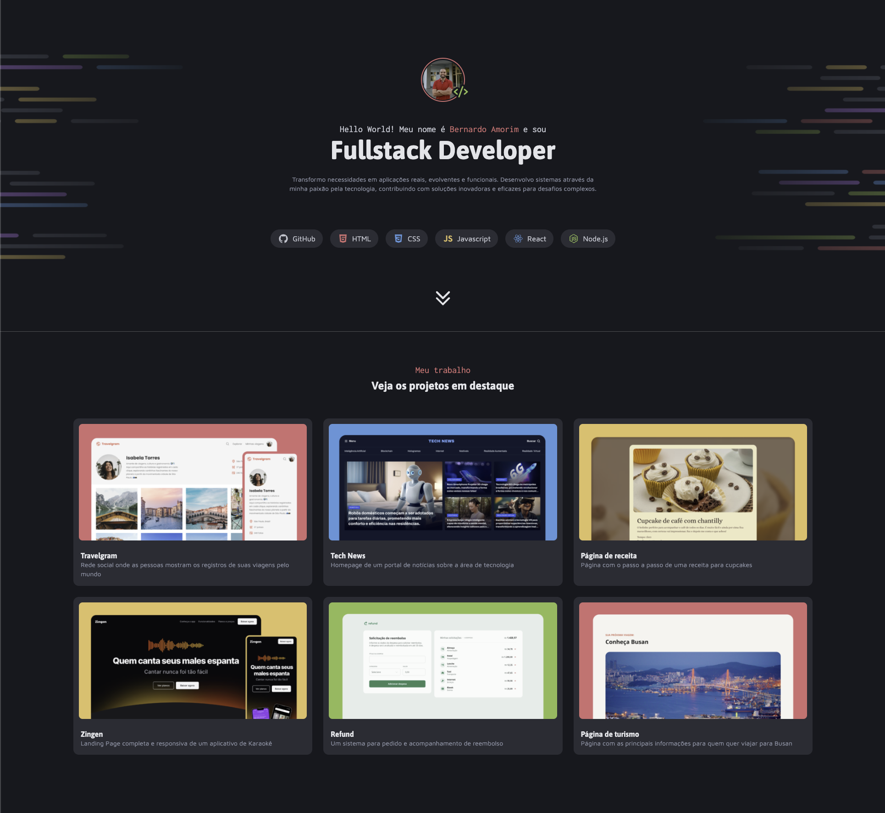

# Dev Portfolio Project

This project is a practical challenge that is part of the Fullstack course provided by Rocketseat.

## Challenge Description

I developed a developer portfolio to showcase the technologies I use, the projects I've been involved in, the services I offer, and how to get in touch with me.

### In this application, you I worked with:

- Creation of layouts with CSS
- Position of elements
- CSS variables
- Pseudo-classes and pseudo-elements

## Technologies Used

- HTML
- CSS

## Author

This project was developed by me. Feel free to reach out!